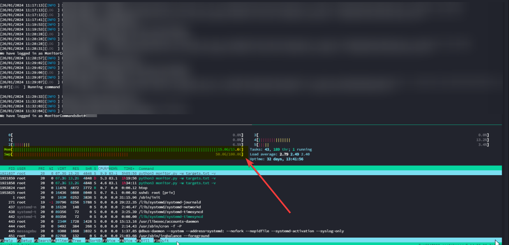
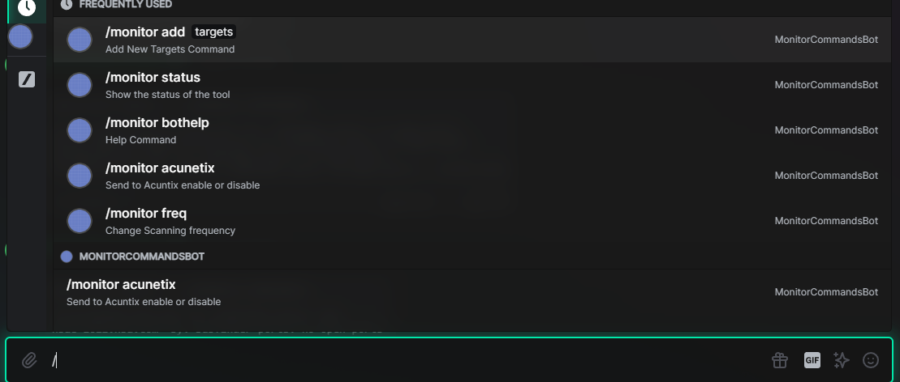

# Monitorizer

Subdomain monitoring framework inspired by [subalert](https://github.com/yassineaboukir/sublert) project

# Scanners integration
- Nuclei integration
- Acunetix integration
  - This integration is disabled by default you must send `/monitor acunetix enable` to your running monitorizer instance to enable this integration
  - You need to have your own Acunetix instance 
  - On a newly discovered subdomain this integration will start new Acunetix scan 
- Dirsearch integration

# Setting up the environment
You need:
- Python  >= 3.6 ( python 2 is not supported )
- Linux server e.g(Amanzon EC2) [64bit]
- at least 16gb ram.
Because the tool take a lot of resources because the async and the multithreading


Before we start you need to install the requirements
```
$ sudo pip3 install -r requirements.txt
```
After installing the requirements now you're ready to go

# Configuration

This tool requires a discord bot to report the findings. Additionally you can use the included acunetix integration to scan the newly discoverd domains

You need to edit the `config/default.yaml` 
```yaml
report:
  discord: # this is the commander bot for pass the commands to the tool
    channel: [Channel ID]
    token: [Bot Token]

  discord_reporter: # this is the reporter bot
    channel: [Channel ID]
    token: [Bot Token]
  
  acunetix: # optional
      token: 63c19a6da79816b21429e5bb262daed863c19a6da79816b21429e5bb262daed8
      host:  acunetix.exmaple.com
      port:  3443

settings:
  nuclei:
    enable: true
    interval: 86400 # rescan all targets in the watch list every 24h
    options: -severity "medium,high,critical" -c 200 -rl 200
```
For more information see: [docs/get_started.md](/docs/get_started.md)

```
$ python monitor.py -w watch_targets.txt
```
if everything is configured currectly to should see this message on your discord channel:


Monitorizer supports more than one subdomain enumeration tool to achieve the best result

but those are useless in this year I think because this as @xElkomy I don't want all of this I just add subfinder and puredns

## The old scanners
```python

scanners = [
	aiodnsbrute, # https://github.com/blark/aiodnsbrute (included)
	subfinder,   # https://github.com/subfinder/subfinder (included)
	sublist3r,   # https://github.com/aboul3la/Sublist3r (included)
	dnsrecon,    # https://github.com/darkoperator/dnsrecon (included)
	dnscan,      # https://github.com/rbsec/dnscan (included)
	amass,       # https://github.com/OWASP/Amass (included)
]

```

## The New Scanners

```python
scanners = (
    "subfinder",
    "puredns"
)
```

command lines can be found at `config/default.yaml`
It is also recommended to add your API keys in the `config/thirdparty/*`

# How to run

As the script runs once everyday to need to host it on a running linux server
```
$ ssh myserver@somewhere.host
$ ls
Monitorizer
$ cd Monitorizer
$ screen -dmS monitorizer bash -c 'python3 monitor.py -w targets.txt'
```

# FAQ
1) Scanning may hang on some targets for a long time
    - Try running the tool with `-d` flag to debug the problem
    - Edit the `timeout` flag at `config/default.yaml` to your desired time in **seconds**